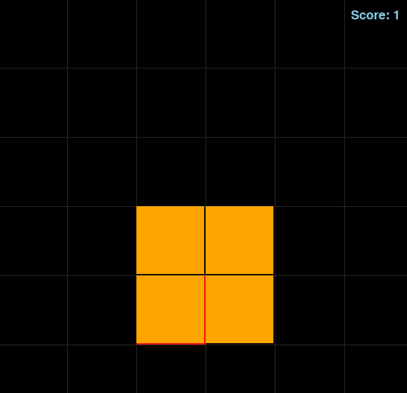

Projeto utiliza de planejador para solucionar e guiar a snake para seu objetivo. 

Para rodar o projeto em ambiente linux basta executar:

python3 snakeGame6.py n

onde n é o tamanho da matrix exemplo:

python3 snakeGame6.py 7

lembrando que o comando do python pode variar de maquina para maquina
Desde ja muito obrigado.

Guilherme, Mar, Henrique. 
